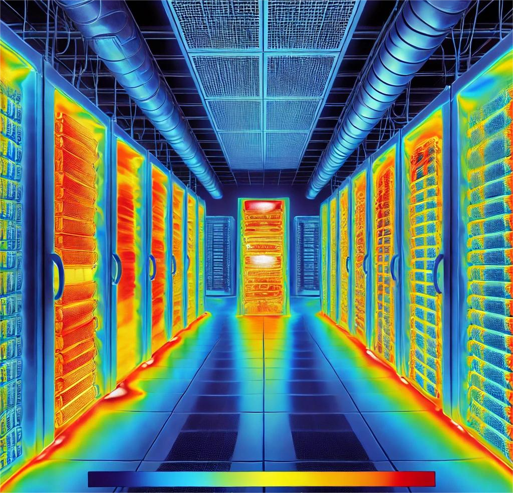
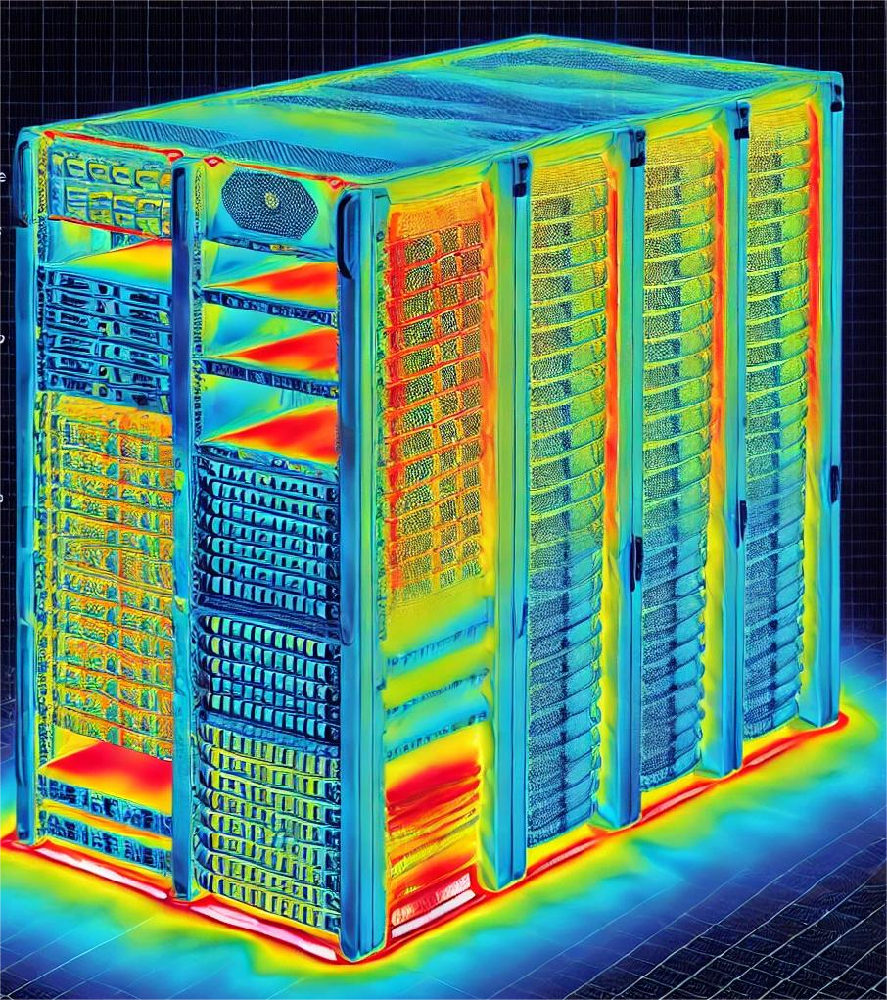
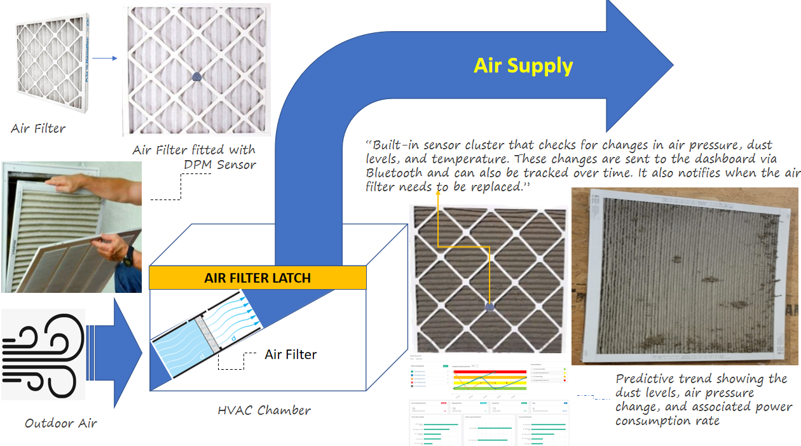

📢 Nominate **[@CGVenkateshRaju](https://github.com/CGVenkateshRaju/)** as a **[GitHub Star](https://stars.github.com/nominate)** if you appreciate the work done here.

---

#  Welcome to DCEWS (DATA CENTER EARLY WARNING SYSTEM)!

I am CG Venkatesh Raju, a passionate technologist with deep expertise in Embedded Systems and Networking, complemented by a strong enthusiasm for Artificial Intelligence and Machine Learning engineering
---

## 📑 Table of Contents

[1.Introduction](#-introduction)
   -
[2.The Problem](#-Problem)
   -
   - [Data Center Pain Points - Consolidate and highlight ](#-DCPP)

[3.The Research](#-Research)
   -
[4.The MVP Testbed](#-Testbed)
   -
[5.The Solution](#-Solution)
   -
   - [Proposed Solution](#-Proposed)
   - [System Architecture](#-system-architecture)
   - [Product Benefits](#-benefits)
   - [Key Features](#-key-features)
   - [Technology Stack](#-technology-stack)

[6.The Takeaway](#-Takeaway)
   -
   - [Why Choose DCEWS?](#-why-choose-dcews)
      - [AI governed | Autonomous handling "AI controlled environment monitoring and handling"](#-AI-governed)
   - [Use Cases](#-use-cases)

[7.Way forward](#-way-forward)
   -
   - [OpenSource Monitoring Integrations](#-OMI)

---
<iframe width="1236" height="695" src="https://www.youtube.com/embed/kn9JVdABxrg" title="ASSASSIN’S CREED SHADOWS Is Way Better Than I Expected (Full Gameplay)" frameborder="0" allow="accelerometer; autoplay; clipboard-write; encrypted-media; gyroscope; picture-in-picture; web-share" referrerpolicy="strict-origin-when-cross-origin" allowfullscreen></iframe>

---

## 📘 Introduction

As network processing power increases, maintaining optimal equipment temperatures has become more challenging due to higher processor densities and rising heat levels. Excessive heat can lead to equipment failure and costly downtime, making efficient cooling systems critical. Since nearly all power consumed by processors is converted to heat, data centers must effectively deliver cold air to equipment intakes and remove hot exhaust to ensure continuous operation and network availability.

Effective power, cooling, and airflow management are essential to prevent data center equipment failure and ensure reliable operation. Since nearly all incoming power converts to heat, maintaining temperatures below 80˚ to 85˚F is critical to avoid overheating. Exceeding this range triggers thermal protection, reducing processing power or shutting down equipment to prevent damage. Prolonged exposure to elevated temperatures can decrease reliability and shorten equipment lifespan, emphasizing the importance of efficient thermal management.

The increasing number of data centers and the high heat density of IT equipment have made energy-efficient thermal management a critical research focus. Localized hybrid air-water cooling offers a targeted solution to address varying heat dissipation levels across racks, unlike traditional air cooling, which often requires over-provisioning. In a closed hybrid air-water cooled server cabinet, heat is removed through a self-contained system, independent of room-level cooling. This study experimentally characterizes a hybrid-cooled enclosed cabinet and its internal components in steady-state conditions. A cabinet-level model was developed to simulate various operational scenarios, including air leakage effects. Additionally, the impact of cooling system failures on IT performance was analyzed, and the time taken for IT equipment to exceed standard temperature thresholds under failure conditions was compared.

Energy-efficient cooling is essential for modern data centers due to increasing heat loads. A hybrid air-water cooling approach offers precise control compared to traditional air cooling, which often leads to inefficiencies. In this study, a closed hybrid-cooled cabinet was tested to analyze its performance under steady-state conditions and simulated failure scenarios. The findings provide insights into air leakage effects and the response time of IT equipment to cooling failures, highlighting the potential benefits and reliability of hybrid cooling systems. 

**The Critical Role of Data Center Temperature Monitoring in Enhancing Storage Device Longevity and Performance**

Effective temperature monitoring within data centers is universally recognized as an essential practice to optimize server performance and extend the lifespan of critical IT infrastructure. Maintaining optimal environmental conditions is of paramount importance, as temperature fluctuations—especially elevated heat levels—can result in severe consequences, including data loss and hardware failure. Therefore, data center administrators must place a strong emphasis on comprehensive environmental monitoring, particularly temperature control, to ensure operational continuity and reliability.

This article delves into the intricate relationship between temperature and IT storage systems, with a primary focus on two commonly used storage technologies: Hard Disk Drives (HDDs) and Solid State Drives (SSDs). Both of these storage solutions are highly sensitive to temperature variations, which can impact their reliability, operational efficiency, and long-term data retention capabilities. By understanding these thermal impacts and adopting robust temperature monitoring solutions, data centers can proactively manage risks and enhance overall infrastructure resilience.

The Adverse Effects of Temperature Extremes on Storage Devices
Hard drives operating outside their optimal temperature range are susceptible to a variety of mechanical and electrical complications. Excessively high or low temperatures can lead to issues such as head misalignment, condensation, and circuit board failures. Interestingly, overcooling hard drives may paradoxically increase failure rates compared to drives running at moderately elevated temperatures, a finding supported by extensive research in the field.

Studies indicate that elevated temperatures can significantly reduce the operational lifespan of hard drives. For instance, research has shown that even a slight increase of 5°C (9°F) in temperature can shorten a hard drive’s lifespan by up to two years.

Temperature-induced performance degradation is another critical concern. Modern hard drives incorporate protective mechanisms that throttle read and write speeds once temperatures exceed a critical threshold, typically around 60°C (140°F). Under such conditions, performance can degrade dramatically—sometimes dropping to speeds as low as 1 MB/s—until the drive returns to a safe operating temperature.

To maintain optimal hard drive performance, experts recommend an operational temperature range of 20°C (68°F) to 45°C (113°F), which balances efficiency and longevity.

**Factors Leading to High Hard Drive Temperatures**
Several elements contribute to elevated temperatures within hard drives, including:

Intensive workload operations with high read/write cycles.
Insufficient cooling mechanisms inside the computer chassis.
Accumulation of dust and debris obstructing airflow.
Malfunctioning or inadequate ventilation systems.
High ambient temperatures in the surrounding environment.
Placement of drives in confined spaces near other heat-generating hardware components.
Effective Temperature Management Strategies for Hard Drives
Ensuring that hard drives remain within the recommended temperature range requires the implementation of several strategies, such as:

Environmental Control: Maintaining consistent ambient temperatures through efficient air conditioning and climate control systems.
Airflow Optimization: Ensuring proper airflow around storage devices to facilitate heat dissipation and prevent localized hotspots.
Proactive Monitoring: Utilizing internal and external temperature sensors to identify and rectify airflow deficiencies.
Hardware Placement: Strategically positioning storage devices away from components that generate excessive heat.
Efficient heat dissipation is crucial to maintaining server reliability. Without proper temperature management, overheating can lead to hardware malfunctions, performance degradation, and even catastrophic system failures.

**Temperature Considerations for Solid State Drives (SSDs)**
While SSDs lack mechanical components, making them less prone to mechanical failure compared to HDDs, they are still highly susceptible to temperature fluctuations. Due to their compact form factor and high-speed data processing capabilities, SSDs typically operate at higher temperatures than HDDs, often exceeding them by approximately 10°C.

Manufacturers generally specify the operational temperature range for SSDs as 0°C to 70°C (32°F to 158°F). However, high-performance SSD variants, such as M.2 SSDs and PCI-E SSDs, demand special attention due to their exposed memory chips and controllers operating at high bandwidths. Heat sinks and proper chassis ventilation play a crucial role in mitigating excessive thermal buildup in these SSD types.

**Factors Contributing to High SSD Temperatures**
Several factors can elevate SSD temperatures, including:

Intensive read/write operations and prolonged workloads.
Poor thermal dissipation within the system enclosure.
Accumulated dust that obstructs airflow.
High ambient temperatures affecting the entire system.
Firmware and controller inefficiencies that hinder proper thermal management.
Routine firmware updates are critical to addressing temperature-related issues and optimizing overall SSD performance.

**Best Practices for SSD Temperature Management**
Maintaining optimal operating conditions for SSDs involves several best practices, including:

Regulated Ambient Temperature: Ensuring the surrounding environment remains within the recommended range to prevent SSD overheating.
Proper Airflow: Deploying efficient cooling solutions and chassis designs that promote adequate airflow.
Continuous Monitoring: Using real-time environmental monitoring tools to detect temperature anomalies and implement timely corrective actions.

**Long-Term Storage Considerations for SSDs**
Long-term storage of SSDs requires careful management of temperature differentials between operational and dormant states. During extended periods of power-off, SSDs rely on maintaining the electrical charge within their flash memory cells for data retention. Temperature extremes can accelerate charge degradation, potentially leading to data loss.

For optimal long-term storage conditions, SSDs should be kept at temperatures below 40°C (104°F) to preserve data integrity over time.

**Understanding SSD Endurance and Data Retention**
SSD endurance is a critical factor in determining how much data can be written to the drive before its reliability diminishes. Manufacturers evaluate endurance based on:

Sustained performance under heavy workloads.
Error correction and data integrity at elevated temperatures.
Data retention capabilities post-write endurance exhaustion.
Newer SSD models exhibit improved longevity and can retain data for extended periods at room temperature, even after extensive usage.

Effective temperature management is a cornerstone of data center operations, directly influencing the reliability and longevity of storage devices such as HDDs and SSDs. Proactive environmental monitoring, coupled with strategic airflow and cooling solutions, enables data centers to strike a balance between operational efficiency and hardware longevity.

By investing in robust temperature monitoring solutions, data center operators can minimize downtime, reduce energy consumption, and achieve optimal performance across their IT infrastructure.

**DATA CENTER EARLY WARNING SYSTEM (DCEWS)** addresses these challenges by integrating Artificial Intelligence (AI) for:

- Automated system monitoring.
- Proactive issue resolution.
- Intelligent decision-making to reduce costs and improve reliability.

Efficient thermal management is a cornerstone of modern infrastructure operations, particularly in data centers, server rooms, and other high-performance environments. The introduction of advanced thermal map sensors revolutionizes this domain by offering precise, real-time monitoring and analysis of temperature variations. These sensors ensure operational stability, reduce energy consumption, and proactively address risks associated with overheating. This document provides a comprehensive guide on the applications, benefits, features, and operational details of thermal map sensors.

This solution ensures that IT infrastructure operates seamlessly, scaling dynamically to meet organizational needs.

---

## The Problem

### Addressing Data Center Pain Points

Efficient cooling and maintaining consistent thermal conditions are critical concerns for data centers. Below are some of the key challenges faced by operators and potential areas for improvement:

#### 1. Cooling Efficiency Challenges

- Continuous Operation Needs: Cooling systems are expected to operate continuously at consistent rates, leading to challenges in optimizing efficiency without disrupting operations.
- Financial Implications of Overcooling: Failure to align cooling with actual thermal needs results in significant financial waste, especially when the air intake temperature falls below the recommended threshold of 64°F.

#### 2. Lack of Airflow Insights

- Airflow Analysis Deficiencies: Gaining insights into airflow patterns and identifying the origin of hotspots remains a pressing issue. This includes challenges associated with:
- Cold-aisle containment
- Hot-aisle containment
- Overhead supply systems
- Underfloor supply systems
- Rack-centered cooling solutions
- Hotspot Identification: Without detailed airflow analysis, operators struggle to discover the root cause of hotspots, leading to inefficient cooling.

#### 3. Need for Wireless-Based Sensors

- Cost-Effective Solutions: Pulling a single Ethernet cable can cost anywhere between $150 to $1,000 per drop, considering cabling, termination, switches, and labor. Wireless sensor deployments offer a more economical alternative, potentially cutting costs by up to 50%.
- Scalability and Flexibility: Wireless sensors provide an adaptable solution for monitoring and managing cooling systems without the extensive infrastructure demands of wired systems.

#### 4. Lack of Unified Visibility

- Single Pane of Glass: There is a need for a centralized platform that provides intuitive insights into cooling non-uniformity.
- Hotspot Patterns: Current systems lack the ability to highlight problematic zones such as the lower and center racks in each row, where temperatures can vary significantly, ranging from 60°F to 90°F.

#### 5. Absence of Innovative Technologies

- Proactive Cooling Strategies: The lack of machine learning (ML)-governed strategies, such as heat transfer analysis, limits the ability to cool data centers effectively, especially those housing next-generation high-performance processors.
- In-Rack Heat Extraction: One of the toughest challenges for data center operators is efficiently extracting heat from densely loaded racks. To compensate, operators often burn excess power and overcool the floor, which can lead to higher operational costs and inefficiencies.
- By addressing these pain points, data centers can significantly improve cooling efficiency, reduce costs, and create a more sustainable and effective thermal management environment. Incorporating wireless sensors, unified monitoring platforms, and ML-driven cooling strategies will be instrumental in overcoming these challenges.

6. As data centers expand, managing space, power, and cooling becomes more challenging. Enterprises are increasingly focusing on system utilization, often finding that around 20% of ghost servers consume energy without serving any business purpose, leading to inefficiencies.

7. The Hot air re-circulation in data centers leads to hot spots, equipment overheating, and warning alarms, often prompting reactive solutions that overlook energy efficiency. Lowering intake air temperature below the threshold is typically considered sufficient, but it results in excessive cooling costs. Producing 60°F chilled air is significantly more expensive than optimizing airflow to maintain intake temperatures below 80.6°F using 77°F air, highlighting the need for improved cooling strategies to reduce energy consumption.

## What is Broken in Current Data Center Management?

The existing Data Center Infrastructure Management (DCIM) and Data Center Management (DCM) tools and platforms fall short in several critical areas, limiting their effectiveness in addressing modern data center challenges. Below are the key shortcomings:

#### 1. Lack of Actionable and Predictive Insights

Operational Blind Spots: Current tools fail to provide actionable, predictive, or prescriptive insights from an operational standpoint, leaving data center operators to rely on reactive measures rather than proactive strategies.
Missed Opportunities for Optimization: Without predictive analytics, operators cannot anticipate potential issues, optimize resource usage, or implement preventive measures to avoid downtime or inefficiencies.

#### 2. Absence of a Distributed, Heterogeneous Sensor Network

Sensor Connectivity Limitations: Modern data centers demand a robust platform capable of connecting a distributed and heterogeneous network of sensors. Current tools often lack this capability, resulting in fragmented data collection and analysis.
Integration Challenges: The inability to seamlessly integrate sensors from different vendors creates silos, hindering the ability to obtain a unified view of data center operations.

#### 3. Lack of Full-Stack Visibility

Limited Monitoring Scope: Existing DCIM and DCM tools provide minimal visibility across the full stack of infrastructure, from physical hardware to applications. This restricts IT managers from gaining comprehensive insights into performance and operational health.
Manual Efforts and Low Automation: With little to no automation, IT managers must manually gather data from a limited set of standard metrics across multiple tools. This labor-intensive approach not only increases workload but also delays decision-making.

#### 4. Dependency on Fragmented Tools

- Multiple Tool Dependencies: Operators often rely on a patchwork of tools to monitor and manage various aspects of the data center. This fragmented ecosystem makes it challenging to aggregate data and derive meaningful insights.
- Inconsistent Data Interpretation: Different tools use varied metrics and reporting formats, making it difficult to interpret data consistently and act on it effectively.
  The Path Forward
- To address these shortcomings, next-generation DCIM and DCM platforms must:

- Leverage AI and ML for actionable, predictive, and prescriptive insights.
- Adopt a unified sensor-connect platform that supports distributed and heterogeneous sensors.
- Provide full-stack visibility with automated data collection and centralized monitoring.
- Reduce tool fragmentation by integrating functionalities into a cohesive, single-pane-of-glass solution.
- By bridging these gaps, future data center management platforms can empower operators to make informed decisions, enhance efficiency, and optimize operations proactively.

---
## The Research

---
##  The MVP TestBed

---

## The Solution

### 🏗️ System Architecture

The DCEWS ecosystem consists of:

1. **Monitoring Module:** Collects real-time data from servers and network devices.
2. **AI Engine:** Processes data for predictive analytics, anomaly detection, and optimization.
3. **Control Interface:** Provides a user-friendly dashboard for insights and management.

Here is an example architecture diagram:

---

### Thermal Management with Thermal Map Sensors

#### Types of Thermal Map Sensors

Thermal map sensors are available in various configurations, each tailored to specific needs:

1. Rack-Level Sensors
   Monitor temperatures at multiple levels within each rack.
   Provide precise readings at the front, rear, top, middle, and bottom for comprehensive coverage.
2. Room-Level Sensors
   Measure environmental conditions across large spaces.
   Useful for identifying overall temperature gradients and optimizing air circulation.
3. Specialized Sensors
   Designed for high-density server environments or industrial setups.
   May include features like humidity sensors and multi-zone temperature monitoring.
4. Wireless Sensors
   Flexible installation without cabling constraints.
   Ideal for retrofitting or temporary deployments in dynamic environments.
   Applications
   Thermal map sensors are versatile tools with wide-ranging applications:

#### 1. Data Centers

Detect hotspots and optimize cooling strategies.
Prevent overheating and equipment failure in high-density environments.

#### 2. Server Rooms

Maintain consistent airflow and temperature distribution.
Reduce overcooling, ensuring energy efficiency and cost-effectiveness.

#### 3. Industrial Facilities

Monitor machinery and operational zones to comply with safety standards.
Prevent thermal shutdowns in equipment-intensive environments.

#### 4. Telecommunication Hubs

Ensure optimal conditions for network and communication equipment.
Minimize risks of downtime due to overheating.

#### 5. Research Laboratories

Provide precise environmental control for sensitive experiments.
Ensure compliance with thermal requirements for equipment and processes.

#### Key Features

1. Real-Time Heatmaps
   Generate dynamic 2D visualizations of temperature distribution.
   Continuously update with sensor data to highlight potential issues.
2. Multi-Zone Monitoring
   Monitor individual racks, rooms, or specific zones.
   Provide granular insights for precise thermal management.
3. Alert Mechanisms
   Visual and audible alarms to notify operators of anomalies.
   Notifications via email, SMS, and SNMP traps for proactive responses.
4. Seamless Integration
   Compatible with SNMP-based platforms like NMS, BMS, and DCIM software.
   Easy integration with existing monitoring systems.
5. 24/7/365 Operation
   Continuous monitoring ensures no thermal risk goes unnoticed.
   Enables predictive maintenance and ongoing optimization.

#### Advantages

Thermal map sensors provide numerous benefits that make them a vital tool for thermal management:

1. Enhanced Precision
   Accurate temperature readings across multiple points ensure comprehensive monitoring.
2. Proactive Risk Management
   Identify and mitigate hotspots before they cause downtime.
   Enable predictive maintenance by analyzing patterns over time.
3. Energy Efficiency
   Reduce overcooling and optimize airflow, lowering operational expenses.
   Support sustainability efforts by cutting energy consumption and carbon footprints.
4. Compliance Assurance
   Meet ASHRAE and Uptime Institute standards for temperature control.
   Avoid costly disruptions caused by regulatory non-compliance.
5. Operational Resilience
   Minimize the risk of equipment failure due to thermal stress.
   Ensure continuous uptime for critical infrastructure.

#### Setup and Installation

Setting up thermal map sensors involves several straightforward steps:

1. Planning and Placement
   Assess the environment to determine optimal sensor placement.
   Position sensors at critical points within racks and across the room.
2. Integration with Systems
   Connect sensors to monitoring platforms via wired or wireless networks.
   Configure SNMP compatibility for seamless communication with existing software.
3. Calibration and Testing
   Calibrate sensors for precise measurements.
   Perform tests to ensure data accuracy and system responsiveness.
   Maintenance and Support
4. Routine Checks
   Regularly inspect sensors for physical damage or misalignment.
   Ensure firmware and software are up-to-date for optimal functionality.
5. Calibration
   Recalibrate sensors periodically to maintain accuracy.
   Address any discrepancies in readings promptly.
6. Troubleshooting
   Use diagnostic tools to resolve connectivity or data issues.
   Engage support services for complex troubleshooting.
   Best Practices
   To maximize the effectiveness of thermal map sensors, follow these best practices:

#### Adopt Proactive Monitoring

Regularly review heatmaps and alerts to address issues early.
Analyze Data Trends

Use historical data to identify patterns and optimize cooling strategies.
Integrate with Existing Systems

Leverage compatibility features to streamline operations.
Ensure Compliance

Align monitoring practices with industry standards and guidelines.
Use Cases
Data Center Optimization

Identify cost-saving opportunities through efficient cooling adjustments.
High-Density Computing

Maintain thermal balance in environments with intensive computational loads.
Disaster Prevention

Detect early signs of overheating and prevent catastrophic failures.

#### Future Enhancements

Thermal map sensors continue to evolve, with potential advancements including:

AI-Powered Analytics: Use machine learning to predict and prevent thermal anomalies.
Cloud Integration: Enable remote monitoring and control through cloud-based platforms.
Multi-Sensor Fusion: Combine temperature data with humidity, airflow, and vibration sensors for comprehensive environmental monitoring.
Conclusion
Thermal map sensors are an essential component of modern infrastructure management. Their ability to provide real-time insights, improve energy efficiency, and ensure compliance makes them a valuable asset for data centers, industrial facilities, and beyond. By adopting these sensors, organizations can enhance reliability, reduce costs, and meet the demands of today’s high-performance environments.

### ✨ Key Features

### Predictive Maintenance

- **Failure Prediction:** AI-powered analytics predict equipment failures before they occur, minimizing downtime and ensuring business continuity.
- **Health Monitoring:** Real-time health monitoring of servers, storage devices, and network gear to identify anomalies and performance degradation.
- **Early Issue Detection:** AI algorithms detect subtle signs of wear and potential failures often missed by human operators.

### Intelligent Inventory Management

- **Smart Tracking:** Automates tracking of inventory levels, including hardware and software assets.
- **Usage Insights:** AI provides insights into equipment usage patterns, enabling better forecasting and efficient resource allocation.
- **Lifecycle Management:** Optimizes equipment lifecycle by identifying when assets need upgrades, repairs, or replacement.

### System Configuration and Optimization

- **Automated Configuration Checks:** Ensures systems remain properly configured, reducing vulnerabilities and operational inefficiencies.
- **Dynamic Adjustments:** AI dynamically optimizes configurations based on workload demands and usage patterns.
- **Policy Enforcement:** Enforces compliance with organizational policies and standards.

### Proactive IT Support

- **Automated Issue Resolution:** AI automates routine maintenance and troubleshooting tasks, freeing up human resources for more complex problems.
- **Incident Prediction and Prevention:** Identifies potential incidents before they escalate, improving system reliability.
- **Performance Tuning:** Continuously analyzes system performance and suggests actionable improvements.

### 🛠️ Technology Stack

    
     
   
 
      
   
     
  

---

### 🚀 Project Benefits

- **Reliability:** Ensures operational uptime.
- **Cost Efficiency:** Reduces unnecessary expenses.
- **Scalability:** Grows with dynamic infrastructure needs.
- **Sustainability:** Manages energy and reduces waste effectively.

---

## The Takeaway

### 🔍 Why Choose DCEWS?

Proven Expertise: Trusted by industry leaders for robust IT management solutions.
End-to-End Support: From setup and deployment to ongoing monitoring and optimization, we’ve got you covered.
Innovation at the Core: Leverage the latest in AI, machine learning, and IoT for unparalleled performance and reliability.
Reimagine the way you manage IT. Proactively address challenges, optimize performance, and ensure the security of your Local Edge, Distributed IT, and Data Center environments. With us, your IT operations are always one step ahead.

| Feature               | DCEWS                     | Traditional Systems       |
| --------------------- | ------------------------- | ------------------------- |
| Failure Prediction    | Yes, AI-powered analytics | Limited, reactive support |
| Resource Optimization | Automated via AI          | Manual configurations     |
| Real-Time Monitoring  | Comprehensive dashboard   | Basic logs                |
| Scalability           | Dynamic and adaptive      | Fixed infrastructure      |

---

### AI governed | Autonomous handling "AI controlled environment monitoring and handling

#### Sensor-Governed Solution: Data Center Providers' Requirements

As data centers continue to expand and evolve, providers are seeking advanced sensor-governed solutions to enhance operational efficiency, improve thermal management, and deliver premium insights to high-profile clients such as Amazon, Google, Microsoft, and Salesforce. Below are the specific requirements and challenges:

Data centers often experience both bypass and re-circulation airflow issues, sometimes occurring independently in different areas and sometimes overlapping. Lowering temperature set points and increasing airflow to address hot spots can unintentionally lead to cooler return air in certain areas, causing fans to circulate uncooled air. This process, known as bypass airflow, can contribute to inefficiencies and even create new hot spots, undermining cooling efforts.

In data centers, managing airflow is complex, with bypass and re-circulation occurring simultaneously. Reactive measures like lowering temperature set points and increasing airflow may result in unintended inefficiencies, such as cooler return air recirculating without cooling, which can lead to energy waste and potential new hot spots. Proper airflow management strategies are essential to avoid such issues and optimize cooling performance.
By addressing bypass airflow and hot air re-circulation issues through measures like sealing leaks and adjusting airflow to match demand, data centers can achieve lower Power Usage Effectiveness (PUE) without relying on free cooling.

Effective environmental monitoring in data centers is crucial for equipment performance and longevity. Insufficient cooling can cause overheating, while excessive cooling leads to unnecessary costs. Data Center Infrastructure Management (DCIM) tools help optimize conditions by monitoring and measuring key environmental factors.

1. Cabinet Thermal-Map Analysis

#### Hotspot Detection: Advanced sensors are needed to perform comprehensive thermal mapping to identify hotspots, monitor intake and exhaust air temperatures, and provide actionable insights for effective cooling management.

Client-Specific Insights: Insights from thermal mapping should be made accessible to premium clients, enabling them to monitor their specific server aisles (e.g., Amazon, Google, Microsoft, Salesforce).
RESTful API Interface: The solution should deliver aisle-, rack-, and cabinet-level insights through a RESTful Gateway API, enabling seamless integration with existing monitoring systems and workflows.
Challenge:

#### Lack of Real-Time Capabilities: Current DCIM platforms cannot provide real-time thermal heatmap analysis.

Manual Auditing Processes: Technicians must routinely perform FLIR recordings using thermal imaging cameras and manually upload the data for auditing, which is time-consuming and costly.
Thermal Imaging Camera Costs: Rental costs range between $45 and $150 per day, adding a significant financial burden for continuous monitoring. 2. Rack Cooling Index (RCI) Metrics and Influencing Factors

#### Comprehensive Metrics: Detailed insights into Rack Cooling Index (RCI) gauge metrics and the factors influencing cooling efficiency are critical for optimizing airflow and temperature management.

Aisle/Cabinet/Rack-Level Analysis: Sensors should provide an in-depth analysis of differential temperature (ΔT) and pressure (ΔP) across various levels, including:
Front, rear, top, middle, and bottom of the server cabinet.
Hot and cold aisle containments for a holistic 360-degree view.
Environmental Insights: Additional metrics such as humidity values should be included to assess their impact on cooling performance and operational reliability.
Challenges:

#### Inadequate Sensor Deployment: Current systems lack the capability to perform detailed, real-time RCI analysis with environmental parameter tracking.

Manual Efforts: The absence of automated and integrated solutions forces reliance on periodic manual data collection and interpretation, leading to inefficiencies.
Proposed Sensor-Governed Solution:
To address these pain points, the ideal solution must incorporate:

#### Real-Time Thermal Mapping: Implement advanced thermal sensors capable of real-time hotspot detection and mapping.

RESTful API Integration: Provide clients with easy access to insights via APIs, ensuring compatibility with modern monitoring systems.
Comprehensive Environmental Monitoring: Use multi-level sensors to track differential temperature, pressure, and humidity for a detailed understanding of airflow and cooling performance.
Automation and Cost Reduction: Replace manual processes with automated, sensor-driven workflows to reduce costs and improve efficiency.
By leveraging cutting-edge sensor technology and integrating with intelligent monitoring systems, data center providers can offer enhanced services to their clients, optimize cooling strategies, and significantly reduce operational overhead.

---

### Thermal Management and Optimization in Data Centers

#### The Challenge of Overheating in Data Centers

Overheating servers rank as the second leading cause of unplanned data center downtime, accounting for nearly one-third of all outages. This pervasive issue underscores the critical need for effective thermal management. In response, many data centers adopt overcooling strategies, which, while mitigating thermal risks, result in excessive energy consumption, higher operational costs, and increased carbon emissions. A balanced approach is essential to optimize energy efficiency, reduce costs, and enhance overall system reliability.

#### Real-Time Monitoring with Heatmaps

Dynamic 2D Heatmaps:
Real-time heatmaps provide continuous temperature monitoring at the rack level, offering an in-depth view of thermal conditions within the data center. Each rack is equipped with multiple sensors strategically placed at key points (front and rear, top, middle, and bottom). These sensors deliver accurate, real-time data that allows operators to:

#### Detect hotspots swiftly.

Identify high rack inlet temperatures.
Address incorrect air temperature readings promptly.
Benefits:
This real-time visualization enables proactive interventions, ensuring thermal risks are managed effectively while maintaining optimal operational conditions.

#### Proactive Hotspot Detection and Alerts

Identifying Hotspots:
Accurate thermal mapping and analysis tools enable the identification of hotspots before they escalate into critical problems. Advanced alert mechanisms ensure timely responses through:

#### Visual and audible alarms.

Notifications via email and SMS.
Integration with SNMP traps for seamless operation within existing network management, building management, and data center infrastructure management software.
Seamless Integration:
The system’s compatibility with SNMP V1/2/3 ensures straightforward integration with widely used monitoring platforms, making it a valuable addition to existing infrastructure.

#### Continuous Thermal Optimization

Round-the-Clock Monitoring:
Effective thermal management demands 24/7/365 monitoring and analysis. By leveraging advanced sensor networks, data center operators can:

- Detect and address potential thermal issues before they compromise critical infrastructure.
- Adjust to changing data center loads, optimizing energy consumption and uncovering cost-saving opportunities.
- Use thermal data not only for alerts but also for ongoing analysis to refine operational efficiency.
- Industry Compliance and Best Practices
- Ensuring Compliance:
- Proper sensor placement at each rack aligns with the recommendations of the ASHRAE (American Society of Heating, Refrigerating and Air-Conditioning Engineers) and the Uptime Institute, two leading authorities in data center operations. By adhering to these guidelines:

#### Operators achieve 100% compliance with temperature and placement standards.

The risk of thermal shutdowns, a leading cause of outages, is significantly reduced.

#### Operational Impact:

Compliance enhances system reliability and aligns operations with industry-recognized best practices, boosting stakeholder confidence and reducing downtime.

#### Conclusion: The Need for Proactive Thermal Management

Thermal risks pose a significant challenge to data center reliability and efficiency. By adopting advanced thermal management tools and strategies, operators can:\*\*

Proactively identify and address hotspots.
Optimize energy consumption and reduce carbon footprints.
Prevent unplanned downtime and protect critical infrastructure.
Comply with industry standards to enhance operational reliability.
Embracing proactive thermal management ensures that data centers remain resilient, energy-efficient, and cost-effective in meeting the demands of modern digital operations.

---

---

### AI-Powered Equipment and Environmental Management System

This project focuses on integrating AI and advanced sensor technologies to monitor, analyze, and optimize equipment performance and environmental conditions, particularly in data centers and industrial facilities. The system leverages continuous monitoring, predictive analytics, and real-time adjustments to ensure operational efficiency, reduce downtime, and extend equipment lifespan.

### Core Features and Capabilities

#### 1. Dust and Air Quality Monitoring

- Continuous Dust Measurement:
- Tracks dust levels in critical areas, including aisle racks and HVAC filter vents, ensuring timely detection of sedimentation.
- Uses STA011 dust sensors to evaluate dust thickness and impact on airflow and cooling efficiency.
- Air Filter Monitoring:
- Built-in sensor cluster detects air pressure, dust levels, and temperature changes in real-time.
- Provides predictive trends showing the relationship between dust levels, air pressure, and power consumption.
- Notifies when air filters need replacement, ensuring optimal performance.

#### 2. Predictive Hotspot Detection

- Hotspot Identification:
- Predicts and identifies hotspot formations from start to endpoints in densely loaded server racks.
- Employs AMG8833 IR thermal sensors to monitor heat distribution.
- Heat Extraction Analysis: Evaluates the toughest challenges faced by data center operators in heat extraction, minimizing the need for excessive cooling and power consumption.

#### 3. Cooling Efficiency Management

- Enhanced Cooling Monitoring:
- Tracks cooling efficiency and ensures it operates continuously at optimal rates.
- Uses BMP388 pressure sensors to monitor changes in airflow velocity caused by varying dust levels.
- Dynamic Fan Adjustments: Monitors changes in fan RPM based on filter conditions, dynamically adapting to maintain efficient airflow.

#### 4. AI-Powered Predictive Maintenance

- Filter Dust-Loading Estimation:
- Measures pressure drop (ΔP) before and after air filters to evaluate dust-loading effects on airflow and cooling performance.
- Uses continuous variables such as ΔP(filter) and RPM to predict operational impact.
- Correlated Sensor Data:
- Compares sensor datasets over time, correlating airflow, temperature, and dust levels to provide actionable insights.
- Predicts power consumption changes and performance degradation trends.
- Sensor Architecture and Integration
- Air Filter Latch with Sensor Cluster:
- Integrated dust, pressure, and thermal sensors.
- Provides Bluetooth-enabled dashboards for real-time tracking and historical data analysis.
- Predictive Insights Dashboard:
- Displays time-based comparisons of sensor data, offering a clear view of environmental and equipment conditions.
- Highlights operational anomalies and suggests maintenance actions.
- Heat extraction is the toughest challenge faced by data center operators to compensate it burns more power and makes the floor cooler than normal and get rid of hot-spots generation in densely loaded RACKS
- Cooling efficiency is top of mind and is expected tp run continously at the same rate.

| Filter Condition | CF (%) | ΔPfilter (Pa) | RPM  |
| ---------------- | ------ | ------------------------ | ---- |
| Clean Filter     | 0      | 10                       | 1500 |
| 10% Covered      | 10     | 12                       | 1450 |
| 20% Covered      | 20     | 15                       | 1400 |
| ...              | ...    | ...                      | ...  |
| 90% Covered      | 90     | 40                       | 1000 |

---

## Revolutionize IT Management: Proactively Monitor, Optimize, and Safeguard IT Infrastructure Across Local Edge, Distributed IT, and Data Centers

Empower your organization with next-generation IT management solutions tailored to meet the complexities of modern infrastructure. Ensure seamless operations, enhanced security, and superior performance with a suite of advanced features designed for proactive monitoring and management.

### Comprehensive IT Oversight with Unified Dashboards

Customizable Dashboards: Simplify IT monitoring with intuitive, template-driven dashboards that can be tailored to individual needs. Visualize critical data points, system health metrics, and performance indicators in real-time.
Single-Pane-of-Glass Visibility: Integrate all IT assets under one unified platform for holistic management, eliminating the need for multiple tools and disparate systems.

### Remote Device Management & Monitoring

Effortless Remote Access: Manage and monitor devices across geographies from a centralized console, ensuring 24/7 uptime.
Automatic Device Discovery: Zero-touch provisioning enables instant setup and onboarding of devices, reducing manual effort.
Pre-configured Templates: Expedite deployment with pre-built templates designed to accommodate diverse IT ecosystems.

### Proactive Problem Detection and Resolution

Intelligent Alerts: Stay ahead of potential issues with preemptive monitoring that detects abnormal usage patterns, configuration changes, and performance anomalies.
Self-Learning Systems: Machine learning-powered baselines continuously adapt to evolving workloads, ensuring accurate detection and minimized false alarms.
Root Cause Diagnostics: Automatically correlate and diagnose problems, reducing mean time to resolution (MTTR) from hours to minutes.

### Built-in Analytics and Advanced Reporting

Key Performance Indicators (KPIs): Monitor essential metrics that align with organizational goals for IT performance and reliability.
In-depth Analytics: Leverage data visualization tools and predictive models to uncover insights, identify trends, and plan for future capacity needs.
Automated Reports: Generate actionable reports on device performance, security vulnerabilities, and system health to inform strategic decisions.

### Enhanced Security and Vulnerability Management

Device Health Assessments: Continuously evaluate device security postures and identify potential vulnerabilities to preempt breaches.
Encrypted Communications: Protect sensitive data with end-to-end encryption, secure payloads, and unique sensor key validations.
Activity Monitoring: Track changes and access patterns across your IT environment to ensure compliance and mitigate unauthorized access.

### Revolutionary Sensor Technology

Smart Sensor Systems: Deploy indoor RF, lighting, and vibration sensors powered by innovative FIX & FORGET technology for effortless long-term operation.
Dynamic Power Management: Optimize battery usage and extend sensor shelf life with intelligent protocols.
Reconfigurable Backhaul Networks: Adapt and scale your wireless sensor infrastructure to evolving requirements.
Performance Monitoring Over Time: Identify performance hot spots, analyze peak usage hours, and predict potential outages.

### Real-Time Data Integration and Visibility

Actionable Insights: Provide IT teams with the tools to diagnose, triage, and resolve issues before they impact end-users.
Dynamic Charting and Visualization: Harness interactive charts and graphs to monitor CPU usage, memory, disk activity, and more in real-time.
Correlated Data Streams: Synchronize and cross-verify metrics across systems for a unified view of IT performance.

### Empower IT Teams with Smarter Tools

Scalable Solutions: From local edge setups to sprawling distributed IT networks and large-scale data centers, adapt seamlessly to varied environments.
Machine Learning Integration: Automate anomaly detection, performance tuning, and predictive maintenance with cutting-edge AI algorithms.
User-Friendly Interfaces: Reduce complexity with intuitive designs that improve operational efficiency and reduce training requirements.

### Key Outcomes for Your IT Infrastructure

Reduced Downtime: Minimize disruptions with faster issue detection and resolution.
Improved Operational Efficiency: Streamline IT workflows and automate repetitive tasks.
Enhanced Security Posture: Proactively safeguard against vulnerabilities and threats.
Future-Ready Infrastructure: Prepare for growth with scalable, intelligent solutions that evolve with your business needs.

## Data Center Infrastructure Management (DCIM) solutions offer numerous benefits, they also have several shortcomings and challenges that organizations should consider:

#### High Implementation Costs:

Initial Investment:
Purchasing hardware (servers, storage, networking) can be expensive.
Software licenses for DCIM tools can also carry a hefty price tag, especially for enterprise-level solutions.
Specialized sensors and monitoring equipment may be required for comprehensive data collection.
Ongoing Expenses:
Maintaining and upgrading hardware and software involves ongoing costs.
Regular maintenance contracts for hardware and software support are often necessary.
Ongoing licensing fees for software may apply.
Skilled IT personnel are required for installation, configuration, and ongoing management, adding to labor costs.

#### Complexity of Integration:

Interfacing with Diverse Systems:
Integrating DCIM with existing IT systems like cloud platforms (AWS, Azure, GCP), legacy infrastructure, and third-party applications (virtualization, monitoring tools) can be complex.
Ensuring seamless data flow and avoiding data silos requires careful planning and integration efforts.
Compatibility Challenges:
Compatibility issues may arise with older equipment and diverse vendor ecosystems.
Ensuring that all components within the data center can be effectively monitored and managed by the DCIM system can be a significant hurdle.

#### Steep Learning Curve:

Complexity of Tools:
DCIM tools can be complex with numerous features and functionalities.
Mastering the system requires significant training for IT staff, which can be time-consuming and expensive.
User Interface:
The user interface and reporting features of some DCIM tools may not be intuitive for non-technical users, hindering their ability to effectively utilize the system.
This can lead to user frustration and reduced adoption within the organization.

#### Data Accuracy Challenges:

Inaccurate Data Input:
Manual data entry is prone to errors, leading to inaccurate data within the DCIM system.
Inconsistent asset tracking methods can also contribute to data inaccuracies.
Impact on Reporting:
Inaccurate data can significantly impact the reliability of reports generated by the DCIM system.
This can lead to incorrect capacity planning, inefficient resource allocation, and poor decision-making.

#### Scalability Limitations:

Difficulty Scaling with Growth:
Some DCIM solutions may not scale effectively as the data center grows.
Adding new devices, expanding capacity, or integrating new sites can become increasingly challenging.
Increased Costs with Scaling:
Scaling up often requires additional hardware, software licenses, and potentially significant reconfiguration efforts, leading to increased costs.

#### Lack of Real-time Insights:

Delayed Responses:
Many DCIM tools do not provide truly real-time monitoring and alerts, leading to delayed responses to critical issues.
This can result in increased downtime and potential service disruptions.
Hindrance to Proactive Decision-Making:
Latency in data collection and processing can hinder proactive decision-making and prevent timely interventions to prevent problems.

#### Security and Compliance Risks:

Cybersecurity Threats:
DCIM solutions can become a target for cyber threats if not properly secured.
Data breaches can expose sensitive information about the data center and its operations.
Compliance Requirements:
Compliance with data regulations (e.g., GDPR, HIPAA) may require additional configurations, audits, and security measures to be implemented within the DCIM system.

#### Vendor Lock-in:

Dependence on Single Vendor:
Organizations may become dependent on a single vendor's ecosystem, making it difficult to switch providers or adopt new technologies.
Limited Interoperability:
Proprietary solutions may have limited interoperability with open-source or competitor products, restricting flexibility and future options.

#### Limited Predictive Analytics:

Lack of Advanced AI/ML Capabilities:
While some DCIM platforms include predictive features, many lack advanced AI/ML capabilities to accurately foresee potential failures.
This can limit the ability to proactively address issues and prevent downtime.
Customization and Investment:
Implementing robust predictive analytics often requires significant customization and investment in specialized AI/ML models.

#### Performance Overhead:

Resource Consumption:
Running DCIM software can consume significant system resources, potentially impacting overall data center performance.
This can lead to slower application response times and reduced overall system efficiency.
Downtime from Updates:
Frequent software updates may introduce downtime or performance degradation, disrupting critical operations.

#### Rack Cooling Index (RCI)
Rack Cooling Index (RCI) is a metric used to assess the effectiveness of cooling within server racks. It takes into account both temperature and airflow, providing a quantitative measure of how well a rack is cooling the IT equipment it contains. RCI helps data center operators identify potential cooling issues and optimize cooling strategies, ensuring that equipment operates within safe temperature ranges and maintains optimal performance.

 

#### Conclusion
Despite these challenges, DCIM remains a valuable tool for improving data center efficiency, but organizations must carefully evaluate their needs and potential limitations before deployment. "   <====

---

## Key Benefits

### Operational Efficiency:

    - Improves system performance by maintaining optimal airflow and temperature conditions.
    - Reduces energy consumption by addressing hotspots and improving cooling efficiency.
    
    - Proactive Maintenance:

    - Predicts potential failures and recommends preventive actions.
    - Extends the lifespan of critical equipment and components.
    - Enhanced Reliability:

    - Continuous monitoring ensures timely identification of anomalies.
    - Minimizes downtime by addressing issues before they escalate.
    - Cost Optimization:

    - Reduces power consumption by optimizing fan and cooling operations.
    - Minimizes maintenance costs through predictive trends and proactive measures.

### Sustainability:

- Promotes energy-efficient operations and reduces waste.
- Future Enhancements
- Machine Learning Models:
- Develop algorithms to refine predictions for hotspot formations, filter replacements, and power consumption.

### Real-Time Alerts:

- Implement advanced notification systems for immediate corrective actions.
- Integration with IoT Platforms:
- Enable seamless data sharing and integration with broader smart facility management systems.
- This AI-powered equipment and environmental management system is designed to transform infrastructure management by ensuring efficiency, reliability, and sustainability through cutting-edge technology.

---

## 🌟 Use Cases

#### 1. **Data Center Monitoring:**

- Tracks server health, performance, and capacity.
- Sends alerts for anomalies like overheating or resource bottlenecks.

#### 2. **IT Operations Automation:**

- Predicts hardware failures and schedules maintenance automatically.
- Balances workloads across servers to optimize performance.

#### 3. **Edge Computing Optimization:**

- Provides heatmaps to detect hotspots and cooling inefficiencies.
- Stores and retrieves 48-hour event history for forensic analysis.

#### 4. **Energy Efficiency Management:**

- Dynamically adjusts cooling systems based on real-time metrics.
- Reduces power consumption by shutting down underutilized servers.

#### 5. DCEWS Heat spot organization Visualization Features enables to ; 
      5.1) Customizable Data Overlays:
         Allow users to overlay additional metrics such as power consumption, airflow efficiency, and rack density onto the heatmap for a more comprehensive analysis.
      5.2)Real-Time Alerts and Threshold Indicators:
         Incorporate dynamic alerts that highlight critical temperature thresholds, enabling proactive responses to potential issues.
      5.3)Predictive Analytics Integration:
         Use AI-driven insights to forecast potential overheating risks based on historical trends, seasonal variations, and equipment usage patterns.
      5.4)Drill-Down Capabilities:
         Enable users to zoom into specific areas of the facility, down to individual racks or equipment, for granular insights and targeted troubleshooting.
      5.5)Customizable Reporting Dashboards:
         Provide tailored reports that can be exported and shared with stakeholders, summarizing trends and recommendations based on heatmap analysis.
      5.6)Multi-Facility Comparison:
         Allow data center owners to compare heatmaps across multiple locations to benchmark performance and identify optimization opportunities.
      5.7)Integration with IoT Sensors:
         Connect with IoT-enabled sensors to collect real-time data from critical equipment and dynamically update the heatmap for continuous monitoring.
      5.8)Historical Trend Analysis:
         Offer time-lapse heatmaps to analyze temperature trends over days, weeks, or months, helping with capacity planning and energy efficiency improvements.
      5.9)User-Friendly Mobile Access:
         Mobile-friendly version of the heatmap visualization, allowing facility managers to monitor conditions from anywhere.
      5.10)Interactive Collaboration Tools:

Provide annotation and collaboration features, enabling teams to mark areas of concern and share insights in real time across departments.
By implementing these features, data center operators can maximize operational efficiency, improve cooling strategies, and extend the lifespan of critical equipment.

---

---

---

## 🤝 Contact & Support

Need help? Feel free to reach out, and we’ll assist you!

---

## 📜 License

This project is licensed under the MIT license. See the LICENSE file for details.
